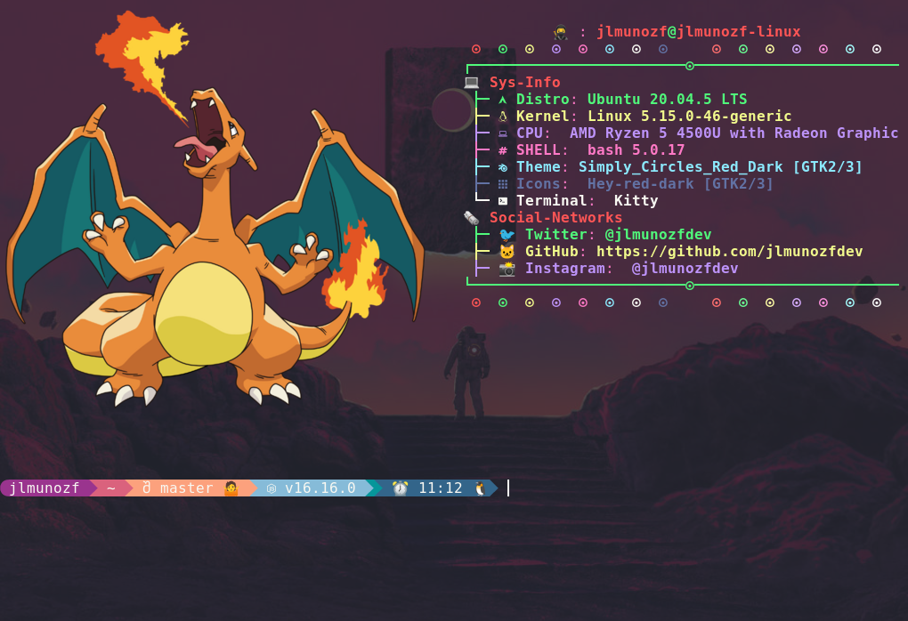

# Neofecth Configuration



## Install

1.- Add repository
```
$ sudo add-apt-repository ppa:dawidd0811/neofetch && sudo apt update && sudo apt install neofetch
```

2.- Run
```
$ neofetch
```
3.- Open a terminal and enter the folder where the Neofetch configuration file is located:
```
$ cd ~/.config/neofetch/
```
4.- Make a copy of the .config file before:

```
$ cp config.conf /home/"your user"/"your file"
```
5.- Git clone the repo
```
git clone https://github.com/jlmunozfdev/neofecth.git
```
6.- Replace config.conf in:
```
/home/"your user"/neofetch/
```

¡Done!

- - -  

<center>

### 👉️ 👉️ 👉️ **Follow me Twitter:**  [@jlmunozf](https://twitter.com/jlmunozfdev)

</center>


